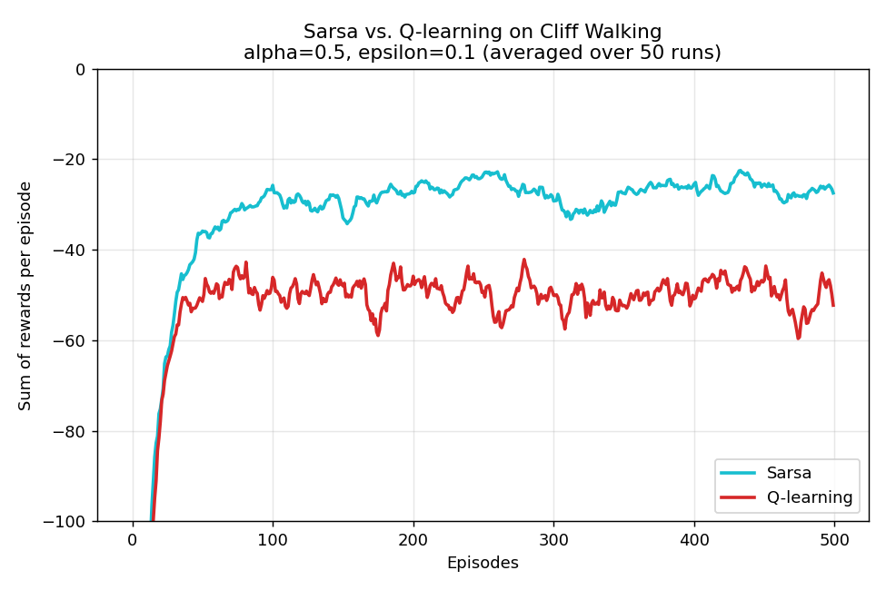
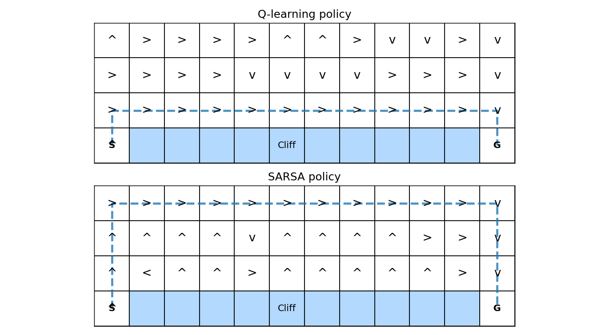
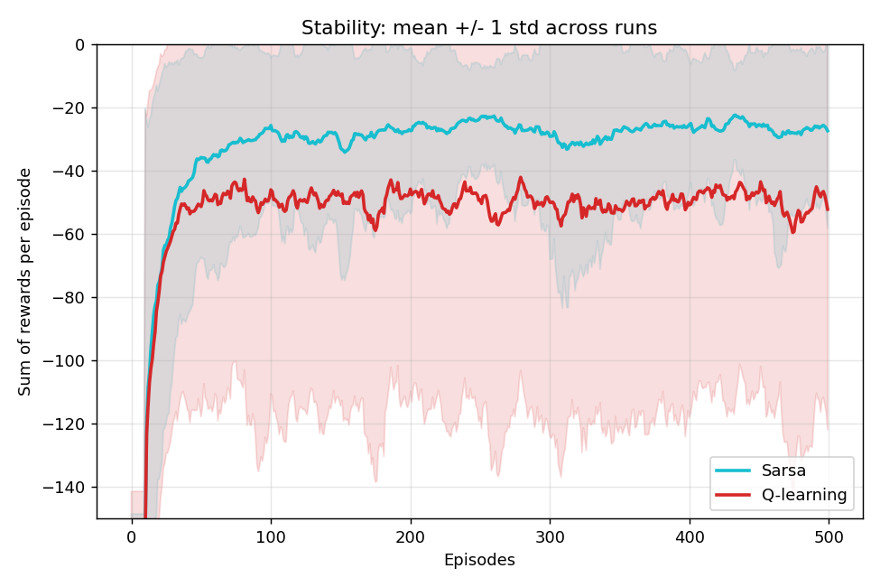

# DRL HW2 — Q-learning vs. SARSA on Cliff Walking

[](https://share.streamlit.io/)

本專案實作並比較兩種經典時序差分（TD）控制演算法——**Q-learning（Off-policy）** 與 **SARSA（On-policy）**——於經典的 **Cliff Walking** 環境中的學習行為、收斂特性與最終策略差異。

實驗設定對應 Sutton & Barto《Reinforcement Learning: An Introduction》(2nd ed.) 中 Example 6.6 / Figure 6.4。

## Live demo

互動式 demo 部署於 **Streamlit Community Cloud**：可即時調整 α、ε、γ、episodes、runs，並同時比較 Q-learning 與 SARSA 的學習曲線、最終策略與路徑。

部署步驟（首次）：
1. 登入 <https://share.streamlit.io>（用 GitHub 帳號）。
2. 點 **Create app** → **Deploy a public app from GitHub**。
3. 選擇 repo `an7172799-ship-it/HW2-Q-learning-and-SARSA-`、branch `main`、主檔 `streamlit_app.py`。
4. 按 **Deploy**。之後每次 push 會自動重新部署。

本地執行：

```bash
pip install -r requirements.txt
streamlit run streamlit_app.py
```

---

## 1. 檔案結構

| 檔案 / 目錄 | 說明 |
| --- | --- |
| `cliff_walking.py` | Cliff Walking 環境（4×12 格子世界） |
| `agents.py` | Q-learning / SARSA 更新邏輯、ε-greedy 策略 |
| `main.py` | 訓練、繪圖、輸出指標（主入口） |
| `streamlit_app.py` | Live demo（Streamlit Cloud） |
| `requirements.txt` | Runtime 相依套件 |
| `learning_curves.png` | 每回合累積獎勵學習曲線（50 runs 平均） |
| `stability.png` | 平均 ± 1 標準差（跨 run 的穩定性） |
| `policies.png` | 兩種方法的貪婪策略與行走路徑 |
| `metrics.txt` | 數值結果 |
| `openspec/` | Spec-driven development artefacts（proposal / tasks / spec） |
| `dev/startup.sh` | 開發起始腳本（git pull + 讀 HANDOVER + 建議下一步） |
| `dev/ending.sh` | 開發收尾腳本（驗證 tasks、封存 spec、更新 HANDOVER、push） |
| `HANDOVER.md` | 交接文件（供下一輪開發者閱讀） |

執行訓練：

```bash
python main.py
```

開發流程（OpenSpec）：

```bash
bash dev/startup.sh   # 起始
# ... 修改 openspec/changes/NN-.../ + 實作 ...
bash dev/ending.sh    # 收尾：封存 spec、更新 HANDOVER、push
```

---

## 2. 環境描述

- 網格：4 × 12
- 起點 S：`(3, 0)`（左下），終點 G：`(3, 11)`（右下）
- 懸崖（Cliff）：底部 `(3, 1..10)`
- 動作：{上、右、下、左}
- 獎勵：每步 −1；掉入懸崖 −100 並回到起點（非終止）；抵達終點結束
- 折扣：γ = 1（未折扣，與 Sutton & Barto 設定相同）

## 3. 實驗參數

| 參數 | 值 |
| --- | --- |
| α（學習率） | 0.5 |
| γ（折扣因子） | 1.0 |
| ε（探索率） | 0.1 |
| 回合數 | 500 |
| 獨立 run 數 | 50 |
| Q 初始化 | 全 0 |

> 作業說明以 α = 0.1 為例；此處採用 α = 0.5 以對齊參考圖（Sutton & Barto Fig. 6.4），結果在質化層面（SARSA 安全、Q-learning 最優但風險高）完全相同。

---

## 4. 演算法

### 4.1 Q-learning（Off-policy）
```
Q(s,a) ← Q(s,a) + α [ r + γ · max_a' Q(s',a') − Q(s,a) ]
```
更新目標使用「下一狀態的最佳動作」——即使 ε-greedy 實際採取的動作不同。故學到的是「greedy policy 的值」，與行為策略分離。

### 4.2 SARSA（On-policy）
```
Q(s,a) ← Q(s,a) + α [ r + γ · Q(s',a') − Q(s,a) ]
```
其中 `a'` 由相同 ε-greedy 策略於 `s'` 抽樣。更新反映「實際正在執行的探索策略」。

兩者皆使用相同的 ε-greedy 行為策略（隨機平手破斷）以確保公平比較。

---

## 5. 結果

### 5.1 學習曲線（每回合累積獎勵）



與參考圖一致：SARSA 收斂到約 **−25**、Q-learning 收斂到約 **−50**。

### 5.2 最終策略與行走路徑



- **Q-learning**：沿懸崖邊緣走最短路徑（長度 13）。這是理論最優策略，但因 ε-greedy 偶爾隨機探索，會有不小機率跌落懸崖。
- **SARSA**：走靠近上方、遠離懸崖的安全路徑（長度 17）。雖然路徑較長，但在 ε-exploration 下實際累積獎勵較高。

### 5.3 穩定性（mean ± 1 std across 50 runs）



### 5.4 數值摘要（`metrics.txt`）

| 指標 | SARSA | Q-learning |
| --- | --- | --- |
| 最後 100 回合平均獎勵 | **−26.42** | −49.22 |
| 全程平均獎勵 | **−35.72** | −55.78 |
| 跨 run 每回合標準差（平均） | **31.80** | 69.73 |
| 貪婪路徑長度 | 17 | **13** |

---

## 6. 分析與討論

### 6.1 收斂速度
兩者在前 ~50 回合內皆快速脫離 −100，收斂速度相近。之後 SARSA 穩定在 −25 附近；Q-learning 穩定在 −50 附近（因訓練中的探索動作仍會使其跌落懸崖）。

### 6.2 策略行為（安全 vs. 最優）
- Q-learning 學到**理論最優**（greedy 下最短）路徑，但那條路徑「一步偏差 = 掉懸崖」。
- SARSA 因為更新目標包含探索動作（`Q(s',a')` 中的 `a'` 來自 ε-greedy），會把「未來可能的隨機跌落」計入 Q 值，所以主動選擇**偏離懸崖**的路徑。

### 6.3 穩定性
SARSA 每回合跨 run 的標準差約為 Q-learning 的一半（31.8 vs 69.7），曲線波動小。Q-learning 因仍會偶發 −100 的回合而劇烈起伏。

### 6.4 探索（ε）的影響
- 若 ε → 0：兩者的貪婪策略會收斂到同一條最優路徑，Q-learning 的實際表現會追平甚至超越 SARSA。
- 若 ε 固定 > 0：SARSA 永遠優於 Q-learning 的**線上**表現（on-line performance）；但 Q-learning 的**離線最優策略**仍更短。

### 6.5 何時用哪一個？
| 情境 | 建議 |
| --- | --- |
| 線上學習、錯誤代價高（機器人、醫療） | **SARSA**：考慮探索風險 |
| 離線求最優 greedy policy、訓練可犯錯 | **Q-learning** |
| 需 function approximation 穩定性 | SARSA 或 Expected SARSA 更好 |
| 確定性環境、少量探索需求 | Q-learning |

---

## 7. 結論

| | 收斂速度 | 線上表現 | 最優性（greedy） | 穩定性 |
| --- | --- | --- | --- | --- |
| Q-learning | 相近 | 較差 | **最優** | 較差 |
| SARSA      | 相近 | **較佳** | 次優（但更安全） | **較佳** |

核心差別：Q-learning 學「我以後總是 greedy 時的價值」；SARSA 學「我繼續這樣探索時的價值」。在有危險區域的環境中，SARSA 會主動迴避風險，是較穩健的選擇；Q-learning 則能得到理論最短路徑但線上代價較高。

---

## 參考

- Sutton, R. S., & Barto, A. G. (2018). *Reinforcement Learning: An Introduction* (2nd ed.), §6.4–6.5, Example 6.6 / Figure 6.4.
